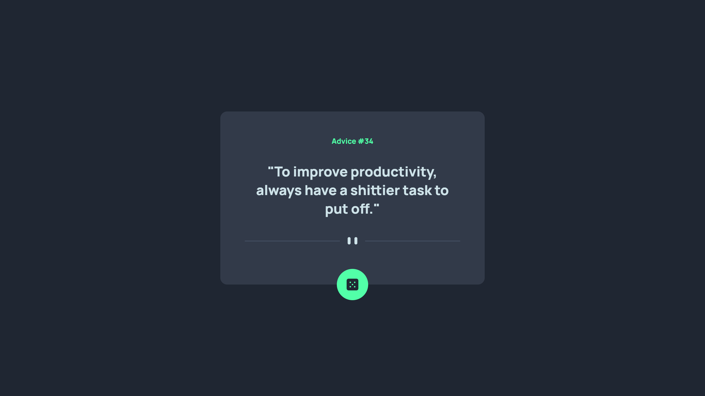

# Frontend Mentor - Advice generator app solution

This is a solution to the
[Advice generator app challenge on Frontend Mentor](https://www.frontendmentor.io/challenges/advice-generator-app-QdUG-13db).
Frontend Mentor challenges help you improve your coding skills by building
realistic projects.

## Table of contents

- [Frontend Mentor - Advice generator app solution](#frontend-mentor---advice-generator-app-solution)
  - [Table of contents](#table-of-contents)
  - [Overview](#overview)
    - [The challenge](#the-challenge)
    - [Screenshot](#screenshot)
    - [Links](#links)
  - [My process](#my-process)
    - [Built with](#built-with)
  - [Author](#author)

## Overview

### The challenge

Users should be able to:

- View the optimal layout for the app depending on their device's screen size
- See hover states for all interactive elements on the page
- Generate a new piece of advice by clicking the dice icon

### Screenshot

### Links

- Solution URL: (https://github.com/Ikenna04/advice-generator-app)
- Live Site URL: (https://ikenna04.github.io/advice-generator-app/)

## My process

### Built with

- Semantic HTML5 markup
- CSS custom properties
- Flexbox
- CSS Grid
- Mobile-first workflow

## Author

EZEORAH IKENNA PASCHAL

<!-- - Website - [Add your name here](https://www.your-site.com) -->

- Frontend Mentor - [@Ikenna04](https://www.frontendmentor.io/profile/Ikenna04)
- Twitter - [@ikenna004](https://www.twitter.com/ikenna004)
